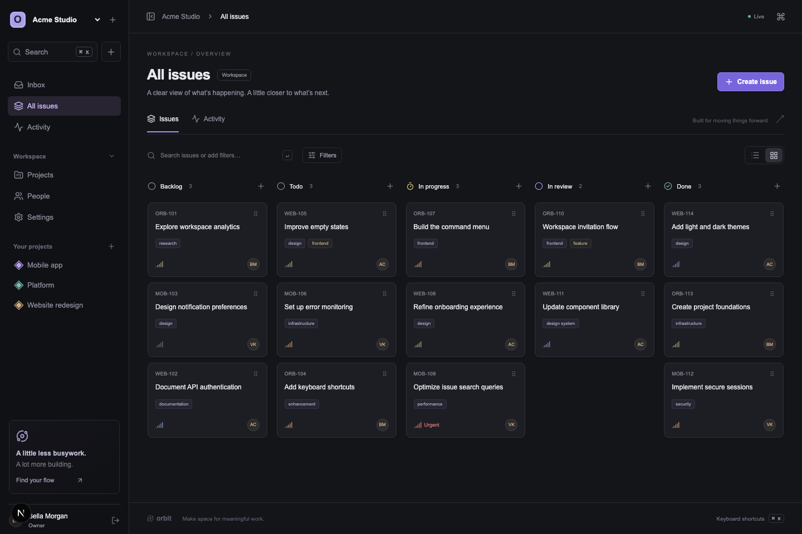

# Orbit

### Multi-tenant Project Management Platform

A full-stack project management application inspired by **Linear** and **Jira**, built to demonstrate production-oriented frontend and backend architecture.

Orbit supports multiple workspaces, projects, issue tracking, role-based access control, realtime updates, notifications, activity history, advanced filtering, and collaborative workflows.

🌐 **Live Demo:** https://saas-application-iiic.onrender.com



---

## ✨ Highlights

- Multi-tenant workspace architecture
- Role-based authorization
- Project and issue management
- Kanban and list views
- Drag-and-drop issue workflow
- Realtime updates with Server-Sent Events
- Optimistic UI updates
- Comments, mentions and attachments
- Notifications and activity history
- Advanced search and shareable filters
- Secure session-based authentication
- PostgreSQL-backed persistence
- Responsive dark/light interface
- Unit, integration and E2E testing

---

## 🛠 Tech Stack

### Frontend

- **Next.js 16** — App Router and Server Components
- **React 19**
- **TypeScript**
- **SCSS Modules**
- **TanStack Query** — server-state management and caching
- **Zustand** — lightweight client UI state
- **Zod** — runtime validation
- **dnd-kit** — accessible drag-and-drop interactions
- **Lucide React** — interface icons

### Backend

- **Next.js Route Handlers**
- **Node.js**
- **PostgreSQL**
- **Raw parameterized SQL**
- **Server-Sent Events (SSE)**
- **scrypt password hashing**
- Cookie-based session authentication

### Testing & Tooling

- **Vitest**
- **Playwright**
- **ESLint**
- **Prettier**
- **TypeScript**
- **tsx**

---

## 🚀 Live Application

The production version is deployed on Render:

**https://saas-application-iiic.onrender.com**

You can create an account directly from the application and start with an empty workspace.

The production environment uses a dedicated PostgreSQL database and versioned SQL migrations.

> The service is currently hosted on Render's free infrastructure, so the first request after a period of inactivity may take a little longer while the instance wakes up.

---

## 📦 Run Locally

### Requirements

Make sure you have:

- Node.js 22+
- PostgreSQL 17+
- npm

No third-party accounts are required.

### 1. Install dependencies

```bash
npm ci
```

### 2. Configure environment variables

Create your local environment file:

```bash
cp .env.example .env
```

Configure:

```env
DATABASE_URL=postgresql://...
APP_ORIGIN=http://localhost:3000
```

`DATABASE_URL` must point to an existing PostgreSQL database.

`APP_ORIGIN` must exactly match the origin from which the application is accessed.

### 3. Apply database migrations

```bash
npm run db:migrate
```

The migration creates the PostgreSQL schema required by Orbit.

### 4. Optional: seed demo data

```bash
SEED_PASSWORD='choose-a-strong-demo-password' npm run db:seed
```

The optional seed creates several demo users:

| User | Role |
| --- | --- |
| `bella@orbit.local` | Owner |
| `anna@orbit.local` | Member |
| `victor@orbit.local` | Member |
| `james@orbit.local` | Viewer |

All seeded users use the password supplied through `SEED_PASSWORD`.

The seed script refuses to overwrite an existing seeded account.

Alternatively, skip this step and register normally to create a new workspace.

### 5. Start the development server

```bash
npm run dev
```

Open:

```text
http://localhost:3000
```

---

## 🐳 PostgreSQL with Docker

A local PostgreSQL instance can also be started with Docker:

```bash
docker compose up -d
npm run db:migrate
npm run dev
```

---

## 🏗 Production Build

Create an optimized production build:

```bash
npm run build
npm start
```

Production requires:

```env
DATABASE_URL=...
APP_ORIGIN=https://your-domain.com
```

Production cookies use the `Secure` flag and therefore require HTTPS.

Orbit uses long-lived SSE connections for realtime updates. Reverse proxies should be configured to avoid response buffering for event streams.

The default production build uses webpack:

```bash
npm run build
```

A Turbopack build is also available:

```bash
npm run build:turbo
```

---

# Product Features

## 👤 Authentication

Orbit provides custom session-based authentication with:

- Registration
- Login and logout
- Expiring sessions
- Secure HttpOnly cookies
- Password hashing with scrypt
- PostgreSQL-backed rate limiting
- Origin validation for unsafe requests
- Server-side authorization

Sessions expire after seven days.

---

## 🏢 Workspaces

Users can create and participate in multiple workspaces.

Each workspace supports:

- Workspace settings
- Members
- Invitations
- Roles and permissions
- Projects
- Issues
- Notifications
- Activity history

Available roles:

- Owner
- Admin
- Member
- Viewer

---

## 📁 Projects

Projects belong to individual workspaces and support:

- Project names and keys
- Descriptions
- Project membership
- Project settings
- Archiving
- Activity tracking

Project membership is organizational and does not act as a private-project security boundary.

---

## 🎫 Issues

Issues support:

- Title
- Description
- Status
- Priority
- Assignee
- Reporter
- Labels
- Due date
- Comments
- Attachments
- Watchers
- Activity history

Supported statuses:

```text
Backlog
Todo
In Progress
In Review
Done
```

Supported priorities:

```text
Urgent
High
Medium
Low
None
```

---

## 📋 Kanban Board

Issues can be displayed using a paginated list or interactive Kanban board.

The board includes:

- Pointer drag-and-drop
- Keyboard drag support
- Optimistic issue movement
- Automatic rollback on failure
- Independent column pagination
- Realtime synchronization

Dragging an issue changes its status only. Within-column ordering is intentionally not persisted.

---

## 🔎 Advanced Search

Orbit supports structured filters alongside full-text search.

Example:

```text
login status:in-progress priority:high assignee:"Anna Chen" label:frontend due:<2026-10-01
```

Filters can target:

- Status
- Priority
- Assignee
- Labels
- Due dates
- Search text

Search state is stored in URL parameters, which makes filtered views shareable.

Unknown filters and invalid values return validation errors.

PostgreSQL full-text search uses English stemming.

---

## 💬 Collaboration

Issues support collaborative functionality including:

- Comments
- Email-style mentions
- Attachments
- Watchers
- Notifications
- Activity history

Example mention:

```text
@anna@example.com
```

Attachments are private and associated with individual issues.

---

## 🔔 Notifications

Users receive workspace notifications for relevant activity.

Orbit supports:

- Unread notification counters
- Notification inbox
- Mark-as-read actions
- Realtime refresh
- Workspace-scoped notification ownership

---

## ⚡ Realtime Updates

Realtime synchronization uses **Server-Sent Events (SSE)**.

The application maintains durable events in PostgreSQL rather than relying on an in-memory event bus.

This allows multiple Node.js instances to observe the same committed changes.

The SSE connection:

- polls for new events
- verifies session validity
- verifies workspace membership
- sends heartbeats
- automatically reconnects
- invalidates affected workspace data

This architecture favors portability and correctness over high-fanout realtime performance.

---

# Architecture

Detailed architectural decisions are documented in:

**[Architecture Decision Record](docs/architecture.md)**

The main application structure is:

```text
src/
├── app/          Server pages and HTTP route adapters
├── server/       Authentication, authorization, transactions and domain services
├── lib/          Shared validation, permissions, search and HTTP contracts
└── components/   Interactive UI, dialogs, query hooks and SCSS modules

db/               Versioned PostgreSQL schema
scripts/          Database migrations, seed and verification utilities
tests/            Unit and integration tests
e2e/              Playwright user journeys
docs/             Architecture, verification and application screenshots
```

---

## Application Boundaries

Orbit intentionally separates server and client responsibilities.

### Server Components

Server Components handle protected entry points and server-rendered data where appropriate.

### Route Handlers

API route handlers independently authenticate and authorize incoming requests.

### Domain Services

Domain services own:

- Business rules
- SQL queries
- Transaction boundaries
- Authorization-sensitive operations

The `server-only` package prevents persistence and authentication code from accidentally entering client bundles.

### Client Components

Client Components are reserved for interactive functionality such as:

- Kanban interactions
- Dialogs
- Search
- Command palette
- Optimistic mutations
- Theme controls

---

# Database Design

The authoritative database schema lives in:

**[`db/001_initial.sql`](db/001_initial.sql)**

The primary relationships are:

```text
Users
  │
  └── Memberships
          │
          ▼
     Workspaces
       │     │
       │     └── Projects
       │            │
       │            ▼
       └───────── Issues
                     │
             ┌───────┼─────────┐
             ▼       ▼         ▼
          Comments Watchers Attachments
```

Users join workspaces through unique:

```text
(workspace_id, user_id)
```

memberships.

Projects and issues belong to workspaces.

Composite foreign keys prevent an issue from referencing a project, member or other resource belonging to another tenant.

---

## Database Features

Issues contain:

- Workspace-allocated numbers
- Version counters
- Reporter references
- Optional assignees
- Array-based labels
- Comments
- Attachments
- Watchers

Audit records intentionally survive issue deletion.

Sessions and invitation tokens are stored as cryptographic digests rather than raw tokens.

Database constraints enforce valid roles, statuses and priorities.

---

## Database Indexing

Indexes cover frequently accessed paths including:

- Workspace pagination
- Issue status
- Projects
- Assignees
- Due dates
- Labels
- Full-text search
- Session expiry
- Unread notifications
- Activity feeds
- Event cursors

GIN indexes are used for labels and PostgreSQL full-text search.

All user-controlled SQL values are parameterized.

No string-interpolated filter values are sent directly to PostgreSQL.

---

# Authentication & Authorization

Authentication uses random 256-bit bearer tokens.

Tokens are:

1. Generated securely
2. Stored in HttpOnly cookies
3. SHA-256 hashed
4. Persisted as digests in PostgreSQL

Production cookies require HTTPS.

Passwords use:

- salted scrypt hashing
- constant-time hash comparison

Login performs equivalent password work even when the requested account does not exist, reducing account-enumeration timing differences.

Account-based rate limits are stored in PostgreSQL.

---

## Role Permissions

| Capability | Owner | Admin | Member | Viewer |
| --- | :---: | :---: | :---: | :---: |
| Read workspace content | ✅ | ✅ | ✅ | ✅ |
| Create/edit/delete issues | ✅ | ✅ | ✅ | ❌ |
| Comment and upload attachments | ✅ | ✅ | ✅ | ❌ |
| Manage projects | ✅ | ✅ | ❌ | ❌ |
| Manage workspace settings | ✅ | ✅ | ❌ | ❌ |
| Manage members | ✅ | ✅ | ❌ | ❌ |
| Invite/manage admins | ✅ | ❌ | ❌ | ❌ |
| Remove or demote owner | ❌ | ❌ | ❌ | ❌ |

Every mutation validates permissions on the server.

Membership locks prevent permission revocation from racing already-authorized writes.

Owners cannot currently be removed or demoted. Ownership transfer is reserved for a future explicit workflow.

Invitations:

- are bound to email addresses
- expire after seven days
- can only be consumed once

API errors distinguish between:

```text
401 Unauthorized
403 Forbidden
404 Not Found
409 Conflict
422 Unprocessable Entity
```

Unsafe routes validate the request origin to reduce CSRF risk.

---

# State Management

Orbit deliberately avoids putting all application state into a single global store.

### TanStack Query

Owns **server state**, including:

- Workspaces
- Projects
- Issues
- Members
- Comments
- Notifications
- Activity

### Zustand

Owns small pieces of **client-only global UI state**, primarily:

- Command palette visibility
- Theme

### URL State

URL parameters own navigational and shareable state:

- Workspace
- Project
- Section
- Search query
- View
- Selected issue

### Local Component State

Temporary drafts and local interactions remain inside individual React components.

---

# Optimistic Updates

Kanban mutations use optimistic updates.

Before sending a mutation, the application:

1. Cancels matching queries
2. Saves the current query state
3. Moves the issue optimistically
4. Sends the server mutation
5. Restores the previous state if the request fails
6. Invalidates relevant queries after settlement

Issues contain version counters.

Stale concurrent edits return:

```text
409 Conflict
```

This provides optimistic concurrency control without silently overwriting newer changes.

---

# Performance

Orbit includes several strategies for keeping large workspaces manageable.

## Cursor Pagination

Issue queries request:

```text
51 rows
```

to return:

```text
50 items + continuation cursor
```

This avoids increasingly expensive offset pagination for large datasets.

---

## Bounded Rendering

Lists and individual Kanban lanes retain a limited number of pages.

This prevents a workspace containing thousands of issues from rendering every issue simultaneously.

---

## Query Design

The backend avoids N+1 request patterns by joining required display data where appropriate.

Server-side searches and management views use bounded pagination.

---

## Database Connections

PostgreSQL pooling is capped per Node.js process.

SQL statements have execution timeouts to prevent indefinitely running queries.

---

## Lazy Loading

Heavy interactive UI such as dialogs and command functionality is loaded lazily where appropriate.

Authenticated responses use private/no-store caching.

---

# Testing

Run the main checks with:

```bash
npm run typecheck
npm run lint
npm test
```

For integration tests:

```bash
npm run test:integration
```

For browser tests:

```bash
npx playwright install chromium
npm run test:e2e
```

---

## Unit Tests

Unit tests cover:

- Permission boundaries
- Search filter parsing
- Input validation
- Password verification
- Token generation

---

## Integration Tests

Integration tests exercise real HTTP requests and PostgreSQL behavior, including:

- CSRF protection
- Tenant isolation
- Concurrent edits
- Audit atomicity
- Single-use invitations
- Logout session revocation

Integration tests are intentionally excluded from ordinary:

```bash
npm test
```

Run them explicitly with:

```bash
npm run test:integration
```

---

## End-to-End Tests

Playwright covers critical user journeys including:

- Registration
- Login
- Workspace creation
- Project creation
- Invitations
- Issue creation and assignment
- Kanban dragging
- Viewer restrictions
- Realtime synchronization
- Comments
- Notifications
- URL-based search
- Keyboard commands
- Optimistic rollback

Browser tests use unique accounts and require a running application.

> Never run automated integration or E2E tests against the production database.

---

# Security Considerations

Orbit is a portfolio application designed with production-oriented security practices, but it is **not presented as an independently audited production system**.

Current security measures include:

- HttpOnly authentication cookies
- Secure production cookies
- SameSite=Lax
- Hashed session tokens
- scrypt password hashing
- Constant-time password comparison
- Origin validation
- Server-side authorization
- Parameterized SQL
- Tenant-aware foreign keys
- PostgreSQL-backed rate limiting
- Input validation
- Attachment size limits

---

# Production Trade-offs

Several capabilities would require additional infrastructure before operating Orbit as a public commercial service.

### Email

Invitation delivery currently uses private copyable links.

A production service should add:

- Email delivery provider
- Email verification
- Password recovery
- MFA

### File Storage

Attachments are currently:

- limited to 5 MB
- limited to 20 files per issue
- stored directly in PostgreSQL

A larger deployment should introduce:

- Object storage
- Malware scanning
- Workspace storage quotas
- File lifecycle policies

### Database Security

Production infrastructure should use a least-privilege runtime database role.

Schema migrations should use a separate owner/migration role.

Tenant isolation is currently enforced through domain services and composite database constraints rather than PostgreSQL Row-Level Security.

### Abuse Prevention

A public deployment should add trusted-edge IP rate limiting, monitoring and additional abuse controls.

The built-in account limiter alone is not intended to defend against distributed registration abuse.

### Realtime Scaling

SSE was selected for simplicity, durability and portability.

For high connection counts, resource-targeted invalidation and dedicated PostgreSQL `LISTEN/NOTIFY` or broker-based fanout should be evaluated.

### Maintenance

A long-running production deployment should schedule cleanup for:

- Expired sessions
- Expired invitations
- Expired rate-limit entries

It should also define:

- Database backup strategy
- Restore procedures
- Audit retention
- Event retention
- Monitoring and alerting

---

# Verification

A detailed verification report is available here:

**[Verification Report](docs/verification.md)**

It documents:

- Checks performed
- Defects discovered and fixed
- Integration verification
- Security considerations
- Remaining production limitations

---

# Design Decisions

Orbit intentionally makes several architectural trade-offs that are useful discussion points:

- **SSE over WebSockets** for one-directional realtime invalidation
- **TanStack Query over global client state** for server-owned data
- **Zustand only for UI state**
- **URL state for shareable navigation and filters**
- **Raw parameterized SQL** for explicit query and transaction control
- **Composite foreign keys** for stronger tenant boundaries
- **Cursor pagination** for scalable issue feeds
- **Optimistic concurrency** for safe collaborative editing
- **Durable database events** instead of a process-local event bus
- **Versioned SQL migrations** for reproducible database deployments

These choices prioritize explicit data ownership, predictable server behavior, tenant isolation and maintainable application boundaries.

---

## 📚 Documentation

Additional technical documentation:

- [Architecture](docs/architecture.md)
- [Database Migration](db/001_initial.sql)
- [Verification Report](docs/verification.md)

---

## 📄 License

This project is currently intended as a portfolio and educational project.

---

<p align="center">
  <strong>Orbit</strong><br />
  Full-stack project management built with Next.js and PostgreSQL.
</p>
